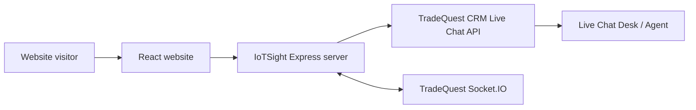
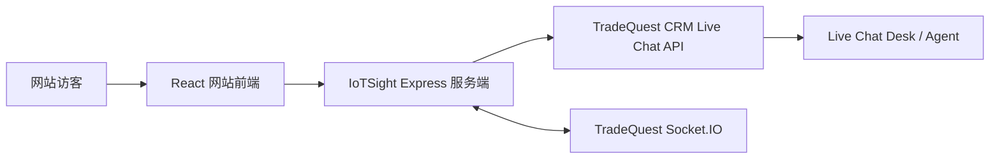

# IoTSight Website

English | 中文

## English

IoTSight is a React and Express powered website for industrial IoT solution marketing, product education, and website live chat lead capture.

The site presents IoTSight solutions for factory energy monitoring, solar and renewable energy, water management, smart agriculture, and building automation. It also includes a live chat widget that connects website visitors to a TradeQuest CRM Live Chat Desk through a server-side proxy.

### Features

- Solution pages for industrial IoT verticals, hardware, software, and architecture content
- Gateway, demo, about, contact, blog, and solution detail routes
- Floating live chat widget with visitor pre-chat form, Socket.IO realtime messages, and REST fallback
- Server-side live chat API proxy that keeps provider tokens out of the browser
- Production build served by Express from `dist`
- GitHub Actions deployment to a VPS with PM2 restart

### Architecture



The browser only calls this website's own API paths:

- `POST /api/live-chat/public/sessions`
- `GET /api/live-chat/public/sessions/:id/messages`
- `POST /api/live-chat/public/sessions/:id/messages`
- Socket.IO path `/socket.io`

The Express server forwards those requests to `LIVE_CHAT_API_BASE_URL` and injects `LIVE_CHAT_API_TOKEN` server-side. The token is never exposed to frontend code or `VITE_` variables.

### Project Structure

- `src/App.tsx`: React routes and app shell
- `src/pages`: website pages
- `src/data/solutions.ts`: solution content
- `src/data/blog.ts`: Markdown blog loader and frontmatter parser
- `src/content/blog/*.md`: blog articles written in Markdown
- `src/components/AIChatWidget.tsx`: live chat widget
- `server.ts`: Express server, static hosting, live chat proxy, Socket.IO bridge
- `.github/workflows/deploy.yml`: CI build and VPS deployment
- `ecosystem.config.cjs`: PM2 process config

### Local Development

Prerequisites:

- Node.js 22 or newer

Install dependencies:

```bash
npm install
```

Create a local environment file if you want to test live chat:

```bash
cp .env.example .env
```

Required live chat values:

```bash
LIVE_CHAT_API_BASE_URL=https://your-tradequest-crm.example.com
LIVE_CHAT_API_TOKEN=your_live_chat_public_api_token
```

Run the development server:

```bash
npm run dev
```

The app listens on `PORT`, defaulting to `3005`.

### Build and Run

Type check:

```bash
npm run lint
```

Build frontend and server:

```bash
npm run build
```

Start production server:

```bash
npm start
```

### Environment Variables

| Variable | Required | Description |
| --- | --- | --- |
| `PORT` | No | HTTP port. Defaults to `3005`. |
| `APP_URL` | No | Public URL of this website. |
| `LIVE_CHAT_API_BASE_URL` | Yes for live chat | TradeQuest CRM origin, for example `https://crm.example.com`. |
| `LIVE_CHAT_API_TOKEN` | Yes for live chat | Live chat public API token generated in TradeQuest Settings -> API Tokens. |
| `GEMINI_API_KEY` | No | Optional key if server-side Gemini features are added or enabled. |

Do not expose `LIVE_CHAT_API_TOKEN` with a `VITE_` prefix. Frontend environment variables are bundled into browser code.

### Live Chat Flow

1. Visitor submits name, email, phone, and optional company in the widget.
2. The frontend calls this site's `/api/live-chat/public/sessions`.
3. The Express server forwards the request to TradeQuest CRM and adds `apiToken` from `LIVE_CHAT_API_TOKEN`.
4. The returned visitor `session.id` and visitor session `token` are stored in local storage.
5. The widget authenticates over Socket.IO with `sessionId` and `visitorToken`.
6. Visitor messages are sent over Socket.IO when available, with REST as fallback.
7. Messages returned from callbacks and realtime events are merged on the frontend to avoid duplicate bubbles.

### Blog Authoring

Blog articles live in `src/content/blog/*.md`. Each file starts with frontmatter metadata followed by Markdown content:

```md
---
id: example-post
title: Example Post
excerpt: Short summary used on the blog list.
date: June 05, 2026
author: Engineering Team
category: Industry Trends
imageUrl: https://example.com/image.jpg
order: 4
---

# Example Post

Write the article body in Markdown.
```

The frontend loads these files through `src/data/blog.ts`, uses the metadata for the blog list, and renders the Markdown body with `react-markdown`.

### VPS Deployment With GitHub Actions

The workflow in `.github/workflows/deploy.yml` builds the app, uploads the release bundle to your VPS over SSH, writes production `.env`, installs production dependencies, and restarts PM2.

Add these repository secrets in GitHub Actions:

- `VPS_HOST`: VPS IP address or domain
- `VPS_USER`: SSH user, for example `root` or `deploy`
- `VPS_SSH_KEY`: private SSH key for deployment
- `LIVE_CHAT_API_BASE_URL`: TradeQuest CRM origin
- `LIVE_CHAT_API_TOKEN`: private live chat provider token
- `APP_URL`: optional production app URL
- `GEMINI_API_KEY`: optional Gemini API key
- `VPS_PORT`: optional SSH port, defaults to `22`
- `VPS_DEPLOY_PATH`: optional deploy path, defaults to `/var/www/iotsight`

You can also set repository variable `PORT` to override the default app port of `3005`.

On the VPS, install Node.js 22 or newer. If PM2 is not installed, the workflow will install it during deployment.

Useful production commands on the VPS:

```bash
pm2 status
pm2 logs iotsight
pm2 restart iotsight
```

## 中文

IoTSight 是一个基于 React 和 Express 的工业物联网官网项目，用于展示解决方案、介绍产品能力，并通过网站 Live Chat 收集潜在客户线索。

网站目前覆盖工厂能源监控、太阳能与新能源、水务管理、智慧农业、楼宇自动化等 IoT 应用场景。项目内置 Live Chat 浮窗组件，访客可以在网站前端发起会话，本站后端通过服务端代理连接 TradeQuest CRM 的 Live Chat Desk。

### 功能

- 工业 IoT 解决方案页面，包含场景、硬件、软件和架构内容
- Gateway、Demo、About、Contact、Blog、Solutions 等网站路由
- Live Chat 浮窗，支持访客表单、Socket.IO 实时消息和 REST fallback
- 服务端 Live Chat API 代理，避免 provider token 暴露到浏览器
- Express 在生产环境中托管 `dist` 构建产物
- GitHub Actions 自动构建并部署到 VPS，使用 PM2 重启服务

### 架构



浏览器只请求本站自己的 API：

- `POST /api/live-chat/public/sessions`
- `GET /api/live-chat/public/sessions/:id/messages`
- `POST /api/live-chat/public/sessions/:id/messages`
- Socket.IO 路径 `/socket.io`

Express 服务端会把这些请求转发到 `LIVE_CHAT_API_BASE_URL`，并在服务端注入 `LIVE_CHAT_API_TOKEN`。该 token 不会进入前端代码，也不要配置为 `VITE_` 变量。

### 项目结构

- `src/App.tsx`：React 路由和应用外壳
- `src/pages`：网站页面
- `src/data/solutions.ts`：解决方案内容
- `src/data/blog.ts`：Markdown Blog 加载器和 frontmatter 解析器
- `src/content/blog/*.md`：使用 Markdown 编写的 Blog 文章
- `src/components/AIChatWidget.tsx`：Live Chat 浮窗组件
- `server.ts`：Express 服务端、静态资源托管、Live Chat 代理、Socket.IO 桥接
- `.github/workflows/deploy.yml`：CI 构建和 VPS 部署流程
- `ecosystem.config.cjs`：PM2 进程配置

### 本地开发

前置要求：

- Node.js 22 或更新版本

安装依赖：

```bash
npm install
```

如果需要本地测试 Live Chat，创建环境变量文件：

```bash
cp .env.example .env
```

Live Chat 必需配置：

```bash
LIVE_CHAT_API_BASE_URL=https://your-tradequest-crm.example.com
LIVE_CHAT_API_TOKEN=your_live_chat_public_api_token
```

启动开发服务：

```bash
npm run dev
```

应用监听 `PORT`，默认端口为 `3005`。

### 构建和运行

类型检查：

```bash
npm run lint
```

构建前端和服务端：

```bash
npm run build
```

启动生产服务：

```bash
npm start
```

### 环境变量

| 变量 | 是否必需 | 说明 |
| --- | --- | --- |
| `PORT` | 否 | HTTP 服务端口，默认 `3005`。 |
| `APP_URL` | 否 | 当前网站的公网访问地址。 |
| `LIVE_CHAT_API_BASE_URL` | Live Chat 必需 | TradeQuest CRM 地址，例如 `https://crm.example.com`。 |
| `LIVE_CHAT_API_TOKEN` | Live Chat 必需 | 在 TradeQuest Settings -> API Tokens 中生成的 Live Chat public API token。 |
| `GEMINI_API_KEY` | 否 | 如果后续启用服务端 Gemini 功能，可配置该 key。 |

不要把 `LIVE_CHAT_API_TOKEN` 配置成 `VITE_` 前缀变量。前端环境变量会被打包进浏览器代码。

### Live Chat 流程

1. 访客在浮窗中提交姓名、邮箱、电话和可选公司名。
2. 前端请求本站 `/api/live-chat/public/sessions`。
3. Express 服务端转发请求到 TradeQuest CRM，并从 `LIVE_CHAT_API_TOKEN` 添加 `apiToken`。
4. 返回的访客 `session.id` 和 visitor session `token` 会保存在 local storage。
5. 浮窗通过 Socket.IO 使用 `sessionId` 和 `visitorToken` 鉴权。
6. 访客消息优先通过 Socket.IO 发送，Socket 不可用时使用 REST fallback。
7. 前端会合并 callback 和实时事件返回的消息，避免同一条消息重复显示。

### Blog 写作

Blog 文章位于 `src/content/blog/*.md`。每个文件以 frontmatter 元数据开头，后面是 Markdown 正文：

```md
---
id: example-post
title: Example Post
excerpt: Short summary used on the blog list.
date: June 05, 2026
author: Engineering Team
category: Industry Trends
imageUrl: https://example.com/image.jpg
order: 4
---

# Example Post

Write the article body in Markdown.
```

前端会通过 `src/data/blog.ts` 加载这些文件，列表页使用元数据，详情页使用 `react-markdown` 渲染 Markdown 正文。

### GitHub Actions 部署到 VPS

`.github/workflows/deploy.yml` 会构建项目，通过 SSH 上传 release 包到 VPS，写入生产 `.env`，安装生产依赖，并重启 PM2。

在 GitHub Actions Secrets 中添加：

- `VPS_HOST`：VPS IP 或域名
- `VPS_USER`：SSH 用户，例如 `root` 或 `deploy`
- `VPS_SSH_KEY`：部署用 SSH 私钥
- `LIVE_CHAT_API_BASE_URL`：TradeQuest CRM 地址
- `LIVE_CHAT_API_TOKEN`：Live Chat provider token
- `APP_URL`：可选，生产环境网站 URL
- `GEMINI_API_KEY`：可选，Gemini API key
- `VPS_PORT`：可选，SSH 端口，默认 `22`
- `VPS_DEPLOY_PATH`：可选，部署路径，默认 `/var/www/iotsight`

也可以在 GitHub Actions Variables 中设置 `PORT`，覆盖默认应用端口 `3005`。

VPS 上需要安装 Node.js 22 或更新版本。如果 PM2 未安装，部署流程会自动安装。

常用生产命令：

```bash
pm2 status
pm2 logs iotsight
pm2 restart iotsight
```
