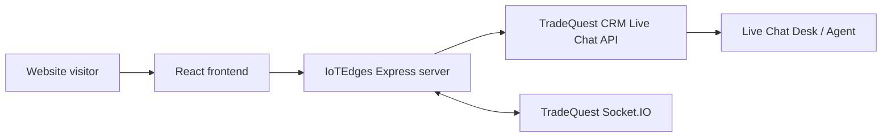

# IoTEdges Website

English | 中文

## English

IoTEdges is a React and Express industrial IoT website for product marketing, SEO content, live chat lead capture, and CRM-backed quote requests.

### Features

- Product pages for gateways, RTUs, Remote IO, remote relay RTUs, gate access controllers, and dashboard software
- Solution pages for factory energy, solar, water, agriculture, building automation, and gate access control
- Markdown content for Blog, Knowledge Base, Products, Solutions, Accessories, and selected site-owned marketing copy
- Build-time prerendering for marketing, product, solution, knowledge, blog, accessories, and utility routes
- Automatic canonical tags, Open Graph tags, JSON-LD, `sitemap.xml`, and `robots.txt`
- Optional Google Analytics 4 and Google Tag Manager injection during build
- Server-side live chat proxy integration with TradeQuest CRM
- CRM-backed Request Quote submission flow with honeypot and minimum-submit-time protection
- GitHub Actions deployment to a VPS with PM2 restart
- Decap CMS admin scaffold with GitHub OAuth Worker support

### Architecture



The browser only calls this website's own endpoints:

- `POST /api/live-chat/public/sessions`
- `GET /api/live-chat/public/sessions/:id/messages`
- `POST /api/live-chat/public/sessions/:id/messages`
- `POST /api/quote-request`
- Socket.IO path `/socket.io`

`LIVE_CHAT_API_TOKEN` stays server-side and must not be exposed with a `VITE_` prefix.

### Project Structure

- `src/pages`: page components
- `src/data/blog.ts`: blog Markdown loader
- `src/data/knowledge.ts`: knowledge Markdown loader
- `src/data/products.ts`: product Markdown loader
- `src/data/solutions.ts`: solution Markdown loader
- `src/data/accessories.ts`: accessories Markdown loader
- `src/data/siteCopy.ts`: file-backed site copy loader
- `src/content/blog/*.md`: blog content
- `src/content/knowledge/*.md`: knowledge content
- `src/content/products/*.md`: product content
- `src/content/solutions/*.md`: solution content
- `src/content/accessories/*.md`: accessories overview content
- `src/content/site-copy/*.md`: homepage and utility page copy
- `public/admin/index.html`: Decap CMS admin entry
- `public/admin/config.yml`: Decap CMS config
- `scripts/prerender.mjs`: prerender, SEO, sitemap, and robots generation
- `server.ts`: Express server and API proxy layer
- `.github/workflows/deploy.yml`: VPS deployment workflow
- `.github/workflows/deploy-decap-auth.yml`: Decap Auth Worker deployment workflow
- `.github/workflows/validate-cms-rollout.yml`: CMS validation workflow

### Local Development

Prerequisites:

- Node.js 22 or newer

Install dependencies:

```bash
npm install
```

Optional local environment file:

```bash
cp .env.example .env
```

Live chat settings:

```bash
LIVE_CHAT_API_BASE_URL=https://your-tradequest-crm.example.com
LIVE_CHAT_API_TOKEN=your_live_chat_public_api_token
```

Start dev server:

```bash
npm run dev
```

Default port: `3005`.

### Build and Validation

Type check:

```bash
npm run lint
```

CMS rollout validation:

```bash
npm run verify:cms-preflight
```

Step-by-step commands:

```bash
npm run verify:cms
```

CMS auth worker smoke test:

```bash
npm run verify:cms-runtime
```

CMS auth preflight:

```bash
npm run verify:cms-auth-preflight
```

CMS build artifact verification:

```bash
npm run verify:cms-build
```

Built production server surface verification:

```bash
npm run verify:server-surface
```

External CMS config consistency verification:

```bash
npm run verify:cms-external-config
```

This checks that `APP_URL`, `DECAP_*` URLs, and `public/admin/config.yml` `base_url` / `site_url` / `display_url` stay aligned.

External auth worker verification:

```bash
npm run verify:auth-worker-surface
```

Live deployment surface verification:

```bash
npm run verify:production-surface
```

This checks the live `/admin/` shell, live `/admin/config.yml`, `robots.txt`, and `sitemap.xml`.

Unified live CMS verification:

```bash
npm run verify:cms-live-surface
```

End-to-end CMS go-live verification:

```bash
npm run verify:cms-go-live
```

Create a CMS dry run report file:

```bash
npm run create:cms-dry-run-report -- --lang en --date 2026-06-18
```

Build:

```bash
npm run build
```

Start production server:

```bash
npm start
```

### Environment Variables

| Variable | Required | Description |
| --- | --- | --- |
| `PORT` | No | HTTP port, default `3005` |
| `APP_URL` | CMS deploy required | Public site URL for canonical URLs, sitemap, and CMS URL consistency checks |
| `VITE_GA_MEASUREMENT_ID` | No | Google Analytics 4 Measurement ID |
| `VITE_GTM_ID` | No | Google Tag Manager Container ID |
| `LIVE_CHAT_API_BASE_URL` | Live chat only | TradeQuest CRM origin |
| `LIVE_CHAT_API_TOKEN` | Live chat only | TradeQuest CRM live chat token |
| `GEMINI_API_KEY` | No | Reserved for optional server-side AI features |

### Content Authoring

The site content currently lives in file-backed Markdown:

- `src/content/blog/*.md`
- `src/content/knowledge/*.md`
- `src/content/products/*.md`
- `src/content/solutions/*.md`
- `src/content/accessories/*.md`
- `src/content/site-copy/*.md`

`gray-matter` is used for frontmatter parsing, so nested arrays and objects are supported for CMS-managed structured fields.

### Decap CMS

Admin path:

```text
/admin/
```

Current collections:

- Blog
- Knowledge Base
- Products
- Solutions
- Accessories Overview
- Site Copy
  - Homepage Copy
  - About Page Copy
  - Contact Page Copy
  - Gateway Page Copy
  - Demo Page Copy

Current rollout logic:

1. Blog
2. Knowledge Base
3. Products
4. Solutions
5. Accessories Overview
6. Site Copy files

This keeps the highest-risk structured collections under tighter control before wider editorial use.

CMS usage quick guide:

1. Open `https://iotedges.com/admin/`.
2. Click the GitHub login button.
3. Sign in with a GitHub account that has write access to `samlau0086/iotsight`.
4. Choose a collection such as `Blog`, `Knowledge Base`, `Products`, `Solutions`, `Accessories Overview`, or `Site Copy`.
5. Create or edit an entry, then click `Save`.
6. Because `publish_mode: editorial_workflow` is enabled, new or edited entries usually move through draft / review style states before final publish.
7. Publish the entry from the CMS editorial workflow view when the content is ready.
8. Wait for the GitHub Actions deployment workflow to finish, then verify the live page on `https://iotedges.com`.

Important notes:

- `/admin/` is a public URL, but only GitHub accounts with repository write access should be able to edit content.
- The repository is currently `public`, so do not add collaborators casually.
- Product, solution, knowledge, and blog entries are file-backed Markdown content. Route slugs, IDs, and key schema fields should be changed carefully.
- Uploaded media is stored under `public/uploads`.
- If login fails, first check `https://cms-auth.iotedges.com/healthz` and `https://iotedges.com/admin/config.yml`.

### CMS Documentation Hub

- `docs/decap-cms-draft.md`
- `docs/decap-cms-config-draft.md`
- `docs/cms-minimum-go-live.md`
- `docs/decap-auth-rollout.md`
- `docs/decap-cms-qa-checklist.md`
- `docs/cms-rollout-sequence.md`
- `docs/github-cloudflare-cms-setup-runbook.md`
- `docs/cms-admin-dry-run-checklist.md`
- `docs/cms-admin-dry-run-report-template.md`
- `docs/cms-go-live-checklist.md`
- `docs/cms-troubleshooting.md`
- `docs/cms-editor-handbook.md`
- `docs/cms-field-glossary.md`
- `docs/media-asset-guidelines.md`
- `docs/content-readiness-audit.zh-CN.md`
- `docs/decap-cms-config-draft.zh-CN.md`
- `docs/cms-minimum-go-live.zh-CN.md`
- `docs/cms-editor-handbook.zh-CN.md`
- `docs/cms-field-glossary.zh-CN.md`
- `docs/cms-admin-dry-run-checklist.zh-CN.md`
- `docs/cms-admin-dry-run-report-template.zh-CN.md`
- `docs/cms-rollout-sequence.zh-CN.md`
- `docs/media-asset-guidelines.zh-CN.md`
- `docs/github-cloudflare-cms-setup-runbook.zh-CN.md`
- `docs/cms-go-live-checklist.zh-CN.md`
- `docs/cms-troubleshooting.zh-CN.md`

### Decap Auth Worker

The repo includes a Cloudflare Worker scaffold for GitHub OAuth:

- `workers/decap-auth-cloudflare/src/index.ts`
- `workers/decap-auth-cloudflare/wrangler.jsonc`
- `workers/decap-auth-cloudflare/.dev.vars.example`

Recommended production layout:

- main site: `https://iotedges.com`
- CMS admin: `https://iotedges.com/admin/`
- auth worker: `https://cms-auth.iotedges.com`

Configured admin backend:

```yml
backend:
  name: github
  repo: samlau0086/iotsight
  branch: main
  base_url: https://cms-auth.iotedges.com
  auth_endpoint: auth
```

Deployment steps:

1. Create a GitHub OAuth App:
   - Application name: `IoTEdges Decap CMS`
   - Homepage URL: `https://iotedges.com/admin/`
   - Authorization callback URL: `https://cms-auth.iotedges.com/callback`
2. In the GitHub repository, add these Actions Secrets:
   - `CLOUDFLARE_API_TOKEN`
   - `CLOUDFLARE_ACCOUNT_ID`
   - `DECAP_GITHUB_CLIENT_ID`
   - `DECAP_GITHUB_CLIENT_SECRET`
3. Add these Actions Variables or Secrets:
   - `DECAP_AUTH_HEALTH_URL=https://cms-auth.iotedges.com/healthz`
   - `DECAP_OAUTH_REDIRECT_URI=https://cms-auth.iotedges.com/callback`
   - `DECAP_OAUTH_SITE_ORIGIN=https://iotedges.com`
   - `DECAP_OAUTH_SCOPE=repo,user`
4. In Cloudflare, create a Worker deployment token with permissions for Workers deployment. If you will manage the Worker custom domain manually in the dashboard, Worker deployment permissions are sufficient.
5. In the Cloudflare DNS page for `iotedges.com`, remove any existing `cms-auth` `A`, `AAAA`, or `CNAME` record that points to the VPS or another service.
6. Run GitHub Actions workflow `Deploy Decap Auth Worker`.
7. In Cloudflare `Workers & Pages`, open Worker `iotedges-decap-auth`, then add Custom Domain `cms-auth.iotedges.com` under `Settings > Domains & Routes`.
8. Wait until the custom domain becomes active, then verify:
   - `https://cms-auth.iotedges.com/healthz`
   - `npm run verify:auth-worker-surface`
9. Deploy the main website to the VPS so the live `/admin/config.yml` matches the Worker base URL.
10. Run final checks:
   - `npm run verify:cms-live-surface`
   - `npm run verify:cms-go-live`

Important DNS note:

- `cms-auth.iotedges.com` should not point to the VPS.
- Do not create a manual `A` record for the Worker.
- Bind `cms-auth.iotedges.com` as a Cloudflare Worker Custom Domain and let Cloudflare manage DNS and TLS for that hostname.

### SEO and Prerendering

`npm run build` prerenders:

- `/`
- `/about`
- `/contact`
- `/demo`
- `/gateway`
- `/accessories`
- `/solutions` and `/solutions/:id`
- `/products` and `/products/:id`
- `/knowledge` and `/knowledge/:id`
- `/blog` and `/blog/:id`

Build output includes:

- page-specific `<title>`, meta description, canonical, Open Graph, and JSON-LD
- `dist/sitemap.xml`
- `dist/robots.txt`

Submit this sitemap to Google Search Console:

```text
https://iotedges.com/sitemap.xml
```

### Analytics and Events

If `VITE_GTM_ID` or `VITE_GA_MEASUREMENT_ID` is provided at build time, generated HTML includes GTM and/or GA4.

Current tracked events include:

- `virtual_page_view`
- `cta_click`
- `lead_form_submit`
- `live_chat_open`
- `live_chat_lead_submit`
- `live_chat_message_send`
- `live_chat_close`

### Request Quote

The Request Quote form posts to `/api/quote-request`, then the server validates and forwards valid requests to the CRM public form endpoint.

Fields:

- `name`
- `company`
- `email`
- `whatsapp`
- `country`
- `application_type`
- `message`
- `_formStartedAt`
- `website_url`

`website_url` is a hidden honeypot field. `_formStartedAt` is used to block too-fast submissions.

### VPS Deployment

`.github/workflows/deploy.yml` handles:

- `npm ci`
- `npm run lint`
- `npm run verify:cms-preflight`
- `npm run verify:cms-auth-preflight`
- `npm run verify:cms`
- `npm run verify:cms-runtime`
- `npm run verify:cms-build`
- `npm run build`
- release upload to VPS
- production `.env` generation
- production dependency install
- PM2 restart

### CMS Go-Live

Before enabling CMS for production use, run:

1. `docs/cms-rollout-sequence.md`
2. `docs/cms-admin-dry-run-checklist.md`
3. `docs/cms-admin-dry-run-report-template.md`
4. `docs/cms-go-live-checklist.md`
5. `docs/cms-troubleshooting.md`
6. `docs/cms-admin-dry-run-checklist.zh-CN.md`
7. `docs/cms-admin-dry-run-report-template.zh-CN.md`
8. `docs/cms-go-live-checklist.zh-CN.md`
9. `docs/cms-rollout-sequence.zh-CN.md`

## 中文

IoTEdges 是一个基于 React 和 Express 的工业物联网网站项目，用于承载产品页面、解决方案页面、SEO 内容、Live Chat 线索收集，以及 CRM 驱动的询盘表单。

### 功能

- 工业 Gateway、RTU、Remote IO、Remote Relay RTU、门禁控制器和 Dashboard 软件产品页
- 工厂能耗、光伏、水务、农业、楼宇自动化和门禁控制等解决方案页面
- 基于 Markdown 的 Blog、Knowledge Base、Products、Solutions、Accessories 和部分站点文案内容体系
- 构建时预渲染营销页、产品页、方案页、知识页、博客页、配件页和辅助页面
- 自动生成 canonical、Open Graph、JSON-LD、`sitemap.xml` 和 `robots.txt`
- 构建时按需注入 Google Analytics 4 和 Google Tag Manager
- 通过服务端代理接入 TradeQuest CRM Live Chat
- CRM 驱动的 Request Quote 提交流程，带蜜罐字段和最短提交时间保护
- 通过 GitHub Actions 自动部署到 VPS，并通过 PM2 重启服务
- 已包含 Decap CMS 管理后台草案和 GitHub OAuth Worker 架构

### 架构


浏览器只调用本站自己的接口：

- `POST /api/live-chat/public/sessions`
- `GET /api/live-chat/public/sessions/:id/messages`
- `POST /api/live-chat/public/sessions/:id/messages`
- `POST /api/quote-request`
- Socket.IO 路径 `/socket.io`

`LIVE_CHAT_API_TOKEN` 只保留在服务端，不能暴露成 `VITE_` 前缀变量。

### 项目结构

- `src/pages`: 页面组件
- `src/data/blog.ts`: Blog Markdown 加载器
- `src/data/knowledge.ts`: Knowledge Markdown 加载器
- `src/data/products.ts`: Products Markdown 加载器
- `src/data/solutions.ts`: Solutions Markdown 加载器
- `src/data/accessories.ts`: Accessories Markdown 加载器
- `src/data/siteCopy.ts`: 站点文案内容加载器
- `src/content/blog/*.md`: Blog 内容
- `src/content/knowledge/*.md`: Knowledge 内容
- `src/content/products/*.md`: Products 内容
- `src/content/solutions/*.md`: Solutions 内容
- `src/content/accessories/*.md`: Accessories 内容
- `src/content/site-copy/*.md`: 首页和辅助页面文案
- `public/admin/index.html`: Decap CMS 后台入口
- `public/admin/config.yml`: Decap CMS 配置
- `scripts/prerender.mjs`: 预渲染、SEO、sitemap、robots 生成脚本
- `server.ts`: Express 服务端和 API 代理层
- `.github/workflows/deploy.yml`: VPS 自动部署流程
- `.github/workflows/deploy-decap-auth.yml`: Decap Auth Worker 部署流程
- `.github/workflows/validate-cms-rollout.yml`: CMS 校验流程

### 本地开发

前置要求：

- Node.js 22 或更高版本

安装依赖：

```bash
npm install
```

如需本地测试 Live Chat，可创建：

```bash
cp .env.example .env
```

Live Chat 变量：

```bash
LIVE_CHAT_API_BASE_URL=https://your-tradequest-crm.example.com
LIVE_CHAT_API_TOKEN=your_live_chat_public_api_token
```

启动开发环境：

```bash
npm run dev
```

默认端口：`3005`。

### 构建与校验

类型检查：

```bash
npm run lint
```

CMS 配置校验：

```bash
npm run verify:cms-preflight
```

分步命令：

```bash
npm run verify:cms
```

CMS Auth Worker 冒烟测试：

```bash
npm run verify:cms-runtime
```

CMS Auth Worker 预检：

```bash
npm run verify:cms-auth-preflight
```

外部配置一致性校验：

```bash
npm run verify:cms-external-config
```

这个命令会检查 `APP_URL`、`DECAP_*` URL，以及 `public/admin/config.yml` 里的 `base_url` / `site_url` / `display_url` 是否一致。

线上 Auth Worker 验证：

```bash
npm run verify:auth-worker-surface
```

线上网站表面验证：

```bash
npm run verify:production-surface
```

这个命令会检查线上 `/admin/` 壳、线上 `/admin/config.yml`、`robots.txt` 和 `sitemap.xml`。

整套 CMS 线上验证：

```bash
npm run verify:cms-live-surface
```

CMS 最终上线总验证：

```bash
npm run verify:cms-go-live
```

CMS 构建产物校验：

```bash
npm run verify:cms-build
```

生成 CMS 试运行报告文件：

```bash
npm run create:cms-dry-run-report -- --lang zh-CN --date 2026-06-18
```

构建：

```bash
npm run build
```

启动生产服务：

```bash
npm start
```

### 环境变量

| 变量 | 是否必需 | 说明 |
| --- | --- | --- |
| `PORT` | 否 | HTTP 端口，默认 `3005` |
| `APP_URL` | CMS 部署必需 | canonical、Open Graph、sitemap 以及 CMS URL 一致性校验使用的公开域名 |
| `VITE_GA_MEASUREMENT_ID` | 否 | Google Analytics 4 Measurement ID |
| `VITE_GTM_ID` | 否 | Google Tag Manager Container ID |
| `LIVE_CHAT_API_BASE_URL` | Live Chat 必需 | TradeQuest CRM 域名 |
| `LIVE_CHAT_API_TOKEN` | Live Chat 必需 | TradeQuest CRM 的 Live Chat token |
| `GEMINI_API_KEY` | 否 | 预留的服务端 AI 功能密钥 |

### 内容管理

当前站点内容源是文件驱动的 Markdown：

- `src/content/blog/*.md`
- `src/content/knowledge/*.md`
- `src/content/products/*.md`
- `src/content/solutions/*.md`
- `src/content/accessories/*.md`
- `src/content/site-copy/*.md`

frontmatter 由 `gray-matter` 解析，因此支持数组和嵌套对象，适合 Decap CMS 管理结构化字段。

### Decap CMS

后台路径：

```text
/admin/
```

当前 collection：

- Blog
- Knowledge Base
- Products
- Solutions
- Accessories Overview
- Site Copy
  - Homepage Copy
  - About Page Copy
  - Contact Page Copy
  - Gateway Page Copy
  - Demo Page Copy

当前建议的 rollout 顺序：

1. Blog
2. Knowledge Base
3. Products
4. Solutions
5. Accessories Overview
6. Site Copy 文件

这样可以先验证高风险结构化 collection，再逐步开放单文件受控文案。

后台使用速查：

1. 打开 `https://iotedges.com/admin/`。
2. 点击 GitHub 登录按钮。
3. 使用对 `samlau0086/iotsight` 这个仓库有写权限的 GitHub 账号登录。
4. 选择需要编辑的 collection，例如 `Blog`、`Knowledge Base`、`Products`、`Solutions`、`Accessories Overview` 或 `Site Copy`。
5. 新建或编辑内容后点击 `Save`。
6. 当前已启用 `publish_mode: editorial_workflow`，因此新内容或已修改内容通常会先进入草稿 / 审核流转状态，再进入最终发布。
7. 内容确认无误后，在 CMS 的 editorial workflow 视图中完成发布。
8. 等待 GitHub Actions 部署流程完成，再到 `https://iotedges.com` 检查线上页面。

注意事项：

- `/admin/` 是公开 URL，但只有对仓库有写权限的 GitHub 账号才应能编辑内容。
- 当前仓库是 `public`，不要随意添加 collaborator。
- Product、Solution、Knowledge、Blog 这些内容本质上仍然是文件驱动 Markdown，修改 route slug、ID 和关键 schema 字段时要非常谨慎。
- 上传的媒体文件会落在 `public/uploads`。
- 如果登录失败，优先检查 `https://cms-auth.iotedges.com/healthz` 和 `https://iotedges.com/admin/config.yml`。

### CMS 文档入口

- `docs/decap-cms-draft.md`
- `docs/decap-cms-config-draft.md`
- `docs/decap-auth-rollout.md`
- `docs/decap-cms-qa-checklist.md`
- `docs/cms-rollout-sequence.md`
- `docs/github-cloudflare-cms-setup-runbook.md`
- `docs/cms-admin-dry-run-checklist.md`
- `docs/cms-admin-dry-run-report-template.md`
- `docs/cms-go-live-checklist.md`
- `docs/cms-troubleshooting.md`
- `docs/cms-editor-handbook.md`
- `docs/cms-field-glossary.md`
- `docs/media-asset-guidelines.md`
- `docs/content-readiness-audit.zh-CN.md`
- `docs/decap-cms-config-draft.zh-CN.md`
- `docs/cms-editor-handbook.zh-CN.md`
- `docs/cms-field-glossary.zh-CN.md`
- `docs/cms-admin-dry-run-checklist.zh-CN.md`
- `docs/cms-admin-dry-run-report-template.zh-CN.md`
- `docs/cms-rollout-sequence.zh-CN.md`
- `docs/media-asset-guidelines.zh-CN.md`
- `docs/github-cloudflare-cms-setup-runbook.zh-CN.md`
- `docs/cms-go-live-checklist.zh-CN.md`
- `docs/cms-troubleshooting.zh-CN.md`

### Decap Auth Worker

仓库中已包含 Cloudflare Worker 版 GitHub OAuth bridge：

- `workers/decap-auth-cloudflare/src/index.ts`
- `workers/decap-auth-cloudflare/wrangler.jsonc`
- `workers/decap-auth-cloudflare/.dev.vars.example`

建议生产结构：

- 主站：`https://iotedges.com`
- CMS 后台：`https://iotedges.com/admin/`
- Auth Worker：`https://cms-auth.iotedges.com`

当前后台配置：

```yml
backend:
  name: github
  repo: samlau0086/iotsight
  branch: main
  base_url: https://cms-auth.iotedges.com
  auth_endpoint: auth
```

部署步骤：

1. 先创建 GitHub OAuth App：
   - Application name：`IoTEdges Decap CMS`
   - Homepage URL：`https://iotedges.com/admin/`
   - Authorization callback URL：`https://cms-auth.iotedges.com/callback`
2. 在 GitHub 仓库中添加这些 Actions Secrets：
   - `CLOUDFLARE_API_TOKEN`
   - `CLOUDFLARE_ACCOUNT_ID`
   - `DECAP_GITHUB_CLIENT_ID`
   - `DECAP_GITHUB_CLIENT_SECRET`
3. 添加这些 Actions Variables 或 Secrets：
   - `DECAP_AUTH_HEALTH_URL=https://cms-auth.iotedges.com/healthz`
   - `DECAP_OAUTH_REDIRECT_URI=https://cms-auth.iotedges.com/callback`
   - `DECAP_OAUTH_SITE_ORIGIN=https://iotedges.com`
   - `DECAP_OAUTH_SCOPE=repo,user`
4. 在 Cloudflare 创建用于 Worker 部署的 API Token。如果你准备在 Cloudflare 控制台里手动管理 custom domain，那么具备 Worker 部署权限即可。
5. 在 `iotedges.com` 的 Cloudflare DNS 页面中，删除任何现有的 `cms-auth` `A`、`AAAA` 或 `CNAME` 记录，尤其是指向 VPS 或其他服务的记录。
6. 运行 GitHub Actions workflow：`Deploy Decap Auth Worker`。
7. 在 Cloudflare `Workers & Pages` 中打开 Worker `iotedges-decap-auth`，然后在 `Settings > Domains & Routes` 下添加 Custom Domain：`cms-auth.iotedges.com`。
8. 等待 custom domain 生效后，验证：
   - `https://cms-auth.iotedges.com/healthz`
   - `npm run verify:auth-worker-surface`
9. 再把主站部署到 VPS，确保线上 `/admin/config.yml` 已使用正确的 Worker `base_url`。
10. 最后执行：
   - `npm run verify:cms-live-surface`
   - `npm run verify:cms-go-live`

DNS 关键说明：

- `cms-auth.iotedges.com` 不应该指向 VPS。
- 不要给 Worker 手动创建 `A` 记录。
- 应该把 `cms-auth.iotedges.com` 绑定为 Cloudflare Worker Custom Domain，让 Cloudflare 接管该子域名的 DNS 和 TLS。

### SEO 与预渲染

`npm run build` 会预渲染：

- `/`
- `/about`
- `/contact`
- `/demo`
- `/gateway`
- `/accessories`
- `/solutions` 和 `/solutions/:id`
- `/products` 和 `/products/:id`
- `/knowledge` 和 `/knowledge/:id`
- `/blog` 和 `/blog/:id`

构建产物会包含：

- 页面级 `<title>`、meta description、canonical、Open Graph、JSON-LD
- `dist/sitemap.xml`
- `dist/robots.txt`

提交到 Google Search Console 的 sitemap：

```text
https://iotedges.com/sitemap.xml
```

### 分析与事件

如果在构建时提供 `VITE_GTM_ID` 或 `VITE_GA_MEASUREMENT_ID`，生成的 HTML 会自动注入 GTM 和或 GA4。

当前关键事件包括：

- `virtual_page_view`
- `cta_click`
- `lead_form_submit`
- `live_chat_open`
- `live_chat_lead_submit`
- `live_chat_message_send`
- `live_chat_close`

### Request Quote

Request Quote 表单提交到 `/api/quote-request`，服务端完成本地校验后再转发到 CRM 公共表单接口。

字段包括：

- `name`
- `company`
- `email`
- `whatsapp`
- `country`
- `application_type`
- `message`
- `_formStartedAt`
- `website_url`

`website_url` 是隐藏蜜罐字段，`_formStartedAt` 用于拦截过快提交。

### VPS 自动部署

`.github/workflows/deploy.yml` 会执行：

- `npm ci`
- `npm run lint`
- `npm run verify:cms-preflight`
- `npm run verify:cms-auth-preflight`
- `npm run verify:cms`
- `npm run verify:cms-runtime`
- `npm run verify:cms-build`
- `npm run build`
- 上传构建产物到 VPS
- 生成生产 `.env`
- 安装生产依赖
- 通过 PM2 重启服务

### CMS 上线准备

正式启用 CMS 前，建议至少按这个顺序执行：

1. `docs/cms-rollout-sequence.md`
2. `docs/cms-admin-dry-run-checklist.zh-CN.md`
3. `docs/cms-admin-dry-run-report-template.zh-CN.md`
4. `docs/cms-go-live-checklist.zh-CN.md`
5. `docs/cms-rollout-sequence.zh-CN.md`
