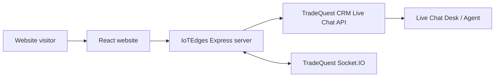

# IoTEdges Website

English | 中文

## English

IoTEdges is a React and Express website for industrial IoT solution marketing, product education, technical SEO content, and live chat lead capture.

The site focuses on industrial IoT gateways, RTUs, Remote IO modules, remote access controllers, Modbus, MQTT, RS485, and remote monitoring solutions for factory energy, solar, water, agriculture, building automation, and gate access control.

### Features

- Industrial IoT solution pages and solution detail pages, including gate access control
- Product pages for IoTEdges gateways, RTUs, Remote IO modules, and remote access controllers
- Markdown-based Blog, Knowledge Base, and public-safe product draft content
- SEO-friendly build-time prerendering for marketing, solution, product, knowledge, and blog routes
- Automatic canonical tags, Open Graph URLs, JSON-LD structured data, `sitemap.xml`, and `robots.txt`
- Optional Google Analytics 4 and Google Tag Manager injection during build
- Live chat widget through a server-side TradeQuest CRM proxy
- GitHub Actions deployment to a VPS with PM2 restart and prerender checks

### Architecture



The browser only calls this website's own API paths:

- `POST /api/live-chat/public/sessions`
- `GET /api/live-chat/public/sessions/:id/messages`
- `POST /api/live-chat/public/sessions/:id/messages`
- Socket.IO path `/socket.io`

The Express server forwards live chat requests to `LIVE_CHAT_API_BASE_URL` and injects `LIVE_CHAT_API_TOKEN` server-side. The token is never exposed to browser code or `VITE_` variables.

### Project Structure

- `src/App.tsx`: React routes and app shell
- `src/pages`: website pages
- `src/data/solutions.ts`: solution content and solution-to-product mapping
- `src/data/blog.ts`: Markdown blog loader
- `src/data/knowledge.ts`: Markdown knowledge base loader
- `src/data/products.ts`: Markdown product page loader
- `src/content/blog/*.md`: blog articles
- `src/content/knowledge/*.md`: protocol and technical knowledge pages
- `src/content/products/*.md`: public-safe product draft pages
- `src/components/AIChatWidget.tsx`: live chat widget
- `scripts/prerender.mjs`: prerender, SEO meta, sitemap, and robots generation
- `server.ts`: Express server, static hosting, live chat proxy, Socket.IO bridge
- `.github/workflows/deploy.yml`: CI build and VPS deployment
- `ecosystem.config.cjs`: PM2 process config

### Local Development

Prerequisites:

- Node.js 22 or newer

Install dependencies:

```bash
npm install
```

Create a local environment file if you want to test live chat:

```bash
cp .env.example .env
```

Required live chat values:

```bash
LIVE_CHAT_API_BASE_URL=https://your-tradequest-crm.example.com
LIVE_CHAT_API_TOKEN=your_live_chat_public_api_token
```

Run the development server:

```bash
npm run dev
```

The app listens on `PORT`, defaulting to `3005`.

### Build and Run

Type check:

```bash
npm run lint
```

Build frontend and server:

```bash
npm run build
```

Start production server:

```bash
npm start
```

### Environment Variables

| Variable | Required | Description |
| --- | --- | --- |
| `PORT` | No | HTTP port. Defaults to `3005`. |
| `APP_URL` | No | Public URL for canonical URLs and sitemap. Defaults to `https://iotedges.com` during prerender. |
| `VITE_GA_MEASUREMENT_ID` | No | Public Google Analytics 4 measurement ID, for example `G-XXXXXXXXXX`. Injected during build. |
| `VITE_GTM_ID` | No | Public Google Tag Manager container ID, for example `GTM-XXXXXXX`. Injected during build. |
| `LIVE_CHAT_API_BASE_URL` | Yes for live chat | TradeQuest CRM origin, for example `https://crm.example.com`. |
| `LIVE_CHAT_API_TOKEN` | Yes for live chat | Live chat API token generated in TradeQuest CRM. |
| `GEMINI_API_KEY` | No | Optional key if server-side Gemini features are enabled later. |

Do not expose `LIVE_CHAT_API_TOKEN` with a `VITE_` prefix. Frontend environment variables are bundled into browser code.

`VITE_GA_MEASUREMENT_ID` and `VITE_GTM_ID` are public tracking IDs, so GitHub Actions Variables are recommended. The workflow also supports the same names as Secrets. If GA4 is already configured inside Google Tag Manager, leave `VITE_GA_MEASUREMENT_ID` empty to avoid double-counting page views.

### Content Authoring

Blog articles live in `src/content/blog/*.md`.

Knowledge Base articles live in `src/content/knowledge/*.md`.

Product draft pages live in `src/content/products/*.md`.

Each file starts with frontmatter metadata followed by Markdown content. Adding a new Markdown file automatically adds it to the corresponding list after the next build or dev-server reload.

Blog frontmatter can include optional related links:

```md
---
id: how-to-choose-4g-gate-opener-europe
title: How to Choose a 4G Gate Opener for Europe
excerpt: Short summary used on the blog list and SEO meta.
date: June 09, 2026
author: Product Management
category: Buyer Guide
imageUrl: https://example.com/image.jpg
relatedProducts: ieac-140-4g-gsm-gate-opener
relatedResources: /solutions/gate-access-control,/knowledge/4g-gsm-gate-opener-europe
order: 4
---

# How to Choose a 4G Gate Opener for Europe
```

Knowledge Base example:

```md
---
id: modbus
title: Modbus for Industrial IoT Gateways and RTUs
excerpt: Short summary used on the knowledge list and SEO meta.
category: Protocol Guide
primaryKeyword: Modbus
relatedProducts: ieg-100-ethernet-industrial-iot-gateway,ier-100-ethernet-industrial-rtu
order: 1
---

# Modbus for Industrial IoT Gateways and RTUs

Write the technical guide in Markdown.
```

Product page example:

```md
---
id: ieg-100-ethernet-industrial-iot-gateway
title: IEG-100 Ethernet Industrial IoT Gateway
excerpt: Short summary used on the product list and SEO meta.
category: Industrial IoT Gateway
model: IEG-100
status: Public-safe draft
primaryKeyword: Ethernet industrial IoT gateway
route: /products/ieg-100-ethernet-industrial-iot-gateway
order: 1
---

## Product Section

Write validation-safe product content in Markdown.
```

Product pages should keep exact ratings, certifications, wireless coverage, protocol limits, and final datasheet values validation-gated until engineering evidence exists.

### SEO and Prerendering

`npm run build` runs the prerender script after the Vite client and SSR builds.

The prerender step generates static HTML for:

- `/`
- main marketing routes
- `/solutions` and every `/solutions/:id`
- `/products` and every `/products/:id`
- `/knowledge` and every `/knowledge/:id`
- `/blog` and every `/blog/:id`

For Blog, Knowledge Base, Product, and Solution pages, prerendering writes page-specific:

- `<title>`
- meta description
- canonical URL
- Open Graph tags
- JSON-LD structured data

The prerender step also writes:

- `dist/sitemap.xml`
- `dist/robots.txt`

If `VITE_GTM_ID` or `VITE_GA_MEASUREMENT_ID` is configured during build, the prerender step also injects Google Tag Manager and/or Google Analytics 4 tags into the generated HTML.

Google tracking tags are not written into the source `index.html`. They appear only in generated files under `dist` after `npm run build`, such as `dist/index.html` and prerendered route HTML files. The GitHub Actions deployment now fails if neither `VITE_GTM_ID` nor `VITE_GA_MEASUREMENT_ID` is configured.

Because the site uses client-side routing, internal page changes do not reload the HTML document. `src/components/AnalyticsPageView.tsx` listens for route changes and sends a `virtual_page_view` event to `dataLayer`. If direct GA4 is configured with `VITE_GA_MEASUREMENT_ID`, it also sends a GA4 `config` update with the new `page_path`, `page_location`, and `page_title`. When using GTM, create a Custom Event trigger for `virtual_page_view` if your GA4 tag is managed inside GTM.

Key conversion events currently pushed to `dataLayer` are:

- `virtual_page_view`: client-side route change
- `cta_click`: marked CTA clicks, including hero, navigation, demo, and solution CTAs
- `lead_form_submit`: contact quote form submission
- `live_chat_open`: live chat widget opened
- `live_chat_lead_submit`: live chat pre-chat form submitted
- `live_chat_message_send`: visitor message sent in live chat
- `live_chat_close`: live chat widget closed

Generated static files are written under `dist`, for example:

- `dist/products/ieg-100-ethernet-industrial-iot-gateway/index.html`
- `dist/knowledge/modbus/index.html`
- `dist/blog/my-post/index.html`

In production, `server.ts` checks for a prerendered `index.html` that matches the request path before falling back to the SPA `dist/index.html`.

### VPS Deployment With GitHub Actions

The workflow in `.github/workflows/deploy.yml` builds the app, uploads the release bundle to the VPS over SSH, writes production `.env`, installs production dependencies, and restarts PM2.

The workflow runs:

- `npm ci`
- `npm run lint`
- `npm run build`
- prerender checks for product pages
- prerender checks for knowledge pages
- SEO discovery file checks for `sitemap.xml` and `robots.txt`

Required GitHub Actions secrets:

- `VPS_HOST`: VPS IP address or domain
- `VPS_USER`: SSH user, for example `root` or `deploy`
- `VPS_SSH_KEY`: private SSH key for deployment
- `LIVE_CHAT_API_BASE_URL`: TradeQuest CRM origin
- `LIVE_CHAT_API_TOKEN`: private live chat provider token

Optional GitHub Actions secrets:

- `APP_URL`: production site URL
- `GEMINI_API_KEY`: optional Gemini API key
- `VPS_PORT`: SSH port, defaults to `22`
- `VPS_DEPLOY_PATH`: deploy path, defaults to `/var/www/iotedges`

Optional GitHub Actions variable:

- `PORT`: production app port, defaults to `3005`
- `VITE_GA_MEASUREMENT_ID`: GA4 measurement ID, for example `G-XXXXXXXXXX`
- `VITE_GTM_ID`: Google Tag Manager container ID, for example `GTM-XXXXXXX`

Useful production commands on the VPS:

```bash
pm2 status
pm2 logs iotedges
pm2 restart iotedges
```

## 中文

IoTEdges 是一个基于 React 和 Express 的工业物联网官网项目，用于展示解决方案、介绍产品能力、发布技术 SEO 内容，并通过网站 Live Chat 收集潜在客户线索。

网站重点围绕工业 IoT Gateway、RTU、Remote IO、Remote Access Controller、Modbus、MQTT、RS485，以及工厂能源监控、光伏监控、水务监控、智慧农业、楼宇自动化和门禁远程控制等场景展开。

### 功能

- 工业物联网解决方案列表页和详情页，包括门禁远程控制场景
- IoTEdges Gateway、RTU、Remote IO、Remote Access Controller 产品页
- 使用 Markdown 管理 Blog、Knowledge Base 和 public-safe 产品草稿内容
- 构建时预渲染营销页、解决方案页、产品页、知识库页和 Blog，提高 SEO 友好度
- 构建时自动生成 canonical、Open Graph URL、`sitemap.xml` 和 `robots.txt`
- 构建时可选注入 Google Analytics 4 和 Google Tag Manager
- Live Chat 浮窗，通过服务端代理连接 TradeQuest CRM
- GitHub Actions 自动部署到 VPS，并通过 PM2 重启服务

### 架构


浏览器只请求本站自己的 API：

- `POST /api/live-chat/public/sessions`
- `GET /api/live-chat/public/sessions/:id/messages`
- `POST /api/live-chat/public/sessions/:id/messages`
- Socket.IO 路径 `/socket.io`

Express 服务端会把 Live Chat 请求转发到 `LIVE_CHAT_API_BASE_URL`，并在服务端注入 `LIVE_CHAT_API_TOKEN`。该 token 不会暴露到浏览器，也不要配置为 `VITE_` 前缀变量。

### 项目结构

- `src/App.tsx`：React 路由和应用外壳
- `src/pages`：网站页面
- `src/data/solutions.ts`：解决方案内容和 solution-to-product 映射
- `src/data/blog.ts`：Markdown Blog 加载器
- `src/data/knowledge.ts`：Markdown Knowledge Base 加载器
- `src/data/products.ts`：Markdown 产品页加载器
- `src/content/blog/*.md`：Blog 文章
- `src/content/knowledge/*.md`：协议和技术知识库页面
- `src/content/products/*.md`：public-safe 产品草稿页
- `src/components/AIChatWidget.tsx`：Live Chat 浮窗组件
- `scripts/prerender.mjs`：预渲染、SEO meta、sitemap 和 robots 生成脚本
- `server.ts`：Express 服务端、静态资源托管、Live Chat 代理、Socket.IO 桥接
- `.github/workflows/deploy.yml`：CI 构建和 VPS 部署流程
- `ecosystem.config.cjs`：PM2 进程配置

### 本地开发

前置要求：

- Node.js 22 或更新版本

安装依赖：

```bash
npm install
```

如果要本地测试 Live Chat，创建环境变量文件：

```bash
cp .env.example .env
```

Live Chat 必需配置：

```bash
LIVE_CHAT_API_BASE_URL=https://your-tradequest-crm.example.com
LIVE_CHAT_API_TOKEN=your_live_chat_public_api_token
```

启动开发服务：

```bash
npm run dev
```

应用监听 `PORT`，默认端口为 `3005`。

### 构建和运行

类型检查：

```bash
npm run lint
```

构建前端和服务端：

```bash
npm run build
```

启动生产服务：

```bash
npm start
```

### 环境变量

| 变量 | 是否必需 | 说明 |
| --- | --- | --- |
| `PORT` | 否 | HTTP 服务端口，默认 `3005`。 |
| `APP_URL` | 否 | 用于 canonical URL 和 sitemap 的公网地址；预渲染默认使用 `https://iotedges.com`。 |
| `VITE_GA_MEASUREMENT_ID` | 否 | 公开的 Google Analytics 4 Measurement ID，例如 `G-XXXXXXXXXX`，构建时注入 HTML。 |
| `VITE_GTM_ID` | 否 | 公开的 Google Tag Manager Container ID，例如 `GTM-XXXXXXX`，构建时注入 HTML。 |
| `LIVE_CHAT_API_BASE_URL` | Live Chat 必需 | TradeQuest CRM 地址，例如 `https://crm.example.com`。 |
| `LIVE_CHAT_API_TOKEN` | Live Chat 必需 | TradeQuest CRM 中生成的 Live Chat API token。 |
| `GEMINI_API_KEY` | 否 | 后续如果启用服务端 Gemini 功能，可配置该 key。 |

不要把 `LIVE_CHAT_API_TOKEN` 配置成 `VITE_` 前缀变量。前端环境变量会被打包进浏览器代码。

`VITE_GA_MEASUREMENT_ID` 和 `VITE_GTM_ID` 是公开追踪 ID，建议放在 GitHub Actions Variables；workflow 也兼容同名 Secrets。若你已经在 GTM 中配置了 GA4，请不要同时设置 `VITE_GA_MEASUREMENT_ID`，否则可能重复统计 page view。

### 内容写作

Blog 文章位于 `src/content/blog/*.md`。

Knowledge Base 文章位于 `src/content/knowledge/*.md`。

产品草稿页位于 `src/content/products/*.md`。

每个文件以 frontmatter 元数据开头，后面是 Markdown 正文。新增 Markdown 文件后，下一次构建或开发服务刷新时会自动进入对应列表。

Blog frontmatter 可以配置相关产品和资源：

```md
---
id: how-to-choose-4g-gate-opener-europe
title: How to Choose a 4G Gate Opener for Europe
excerpt: 用于 Blog 列表和 SEO meta 的简短摘要。
date: June 09, 2026
author: Product Management
category: Buyer Guide
imageUrl: https://example.com/image.jpg
relatedProducts: ieac-140-4g-gsm-gate-opener
relatedResources: /solutions/gate-access-control,/knowledge/4g-gsm-gate-opener-europe
order: 4
---

# How to Choose a 4G Gate Opener for Europe
```

Knowledge Base 示例：

```md
---
id: modbus
title: Modbus for Industrial IoT Gateways and RTUs
excerpt: 用于知识库列表和 SEO meta 的简短摘要。
category: Protocol Guide
primaryKeyword: Modbus
relatedProducts: ieg-100-ethernet-industrial-iot-gateway,ier-100-ethernet-industrial-rtu
order: 1
---

# Modbus for Industrial IoT Gateways and RTUs

使用 Markdown 编写技术指南。
```

产品页示例：

```md
---
id: ieg-100-ethernet-industrial-iot-gateway
title: IEG-100 Ethernet Industrial IoT Gateway
excerpt: 用于产品列表和 SEO meta 的简短摘要。
category: Industrial IoT Gateway
model: IEG-100
status: Public-safe draft
primaryKeyword: Ethernet industrial IoT gateway
route: /products/ieg-100-ethernet-industrial-iot-gateway
order: 1
---

## Product Section

使用 Markdown 编写验证安全的产品内容。
```

产品页在工程证据完成前，应继续使用 validation-safe 措辞，不发布精确电气规格、认证、无线覆盖、协议限制或最终 datasheet 参数。

### SEO 和预渲染

`npm run build` 会在 Vite 客户端构建和 SSR 构建后执行预渲染脚本。

预渲染会为以下页面生成静态 HTML：

- `/`
- 主要营销页面
- `/solutions` 和每个 `/solutions/:id`
- `/products` 和每个 `/products/:id`
- `/knowledge` 和每个 `/knowledge/:id`
- `/blog` 和每个 `/blog/:id`

对于 Blog、Knowledge Base、Product 和 Solution 页面，预渲染会写入页面专属的：

- `<title>`
- meta description
- canonical URL
- Open Graph tags

预渲染还会生成：

- `dist/sitemap.xml`
- `dist/robots.txt`

如果构建时配置了 `VITE_GTM_ID` 或 `VITE_GA_MEASUREMENT_ID`，预渲染脚本还会把 Google Tag Manager 和/或 Google Analytics 4 标签注入生成的 HTML。

Google tracking 标签不会写入源码 `index.html`，只会在 `npm run build` 后出现在 `dist` 目录的生成文件中，例如 `dist/index.html` 和各个预渲染路由 HTML。现在 GitHub Actions 会在 `VITE_GTM_ID` 和 `VITE_GA_MEASUREMENT_ID` 都未配置时直接失败，避免无追踪代码的版本被部署。

由于网站使用前端路由，站内页面切换不会重新加载 HTML 文档。`src/components/AnalyticsPageView.tsx` 会监听路由变化，并向 `dataLayer` 发送 `virtual_page_view` 事件。如果通过 `VITE_GA_MEASUREMENT_ID` 直接配置 GA4，它也会同步发送带有新 `page_path`、`page_location` 和 `page_title` 的 GA4 `config` 更新。若 GA4 是通过 GTM 管理，请在 GTM 中为 `virtual_page_view` 创建 Custom Event 触发器。

当前会推送到 `dataLayer` 的关键转化事件包括：

- `virtual_page_view`：前端路由页面切换
- `cta_click`：已标记的 CTA 点击，包括首页、导航、Demo 和 Solution CTA
- `lead_form_submit`：联系页询盘表单提交
- `live_chat_open`：打开 Live Chat
- `live_chat_lead_submit`：Live Chat 访客信息表单提交
- `live_chat_message_send`：访客发送 Live Chat 消息
- `live_chat_close`：关闭 Live Chat

生成的静态文件会写入 `dist`，例如：

- `dist/products/ieg-100-ethernet-industrial-iot-gateway/index.html`
- `dist/knowledge/modbus/index.html`
- `dist/blog/my-post/index.html`

生产环境中，`server.ts` 会先查找与请求路径匹配的预渲染 `index.html`，找不到时再 fallback 到 SPA 的 `dist/index.html`。

### GitHub Actions 部署到 VPS

`.github/workflows/deploy.yml` 会构建项目，通过 SSH 上传 release 包到 VPS，写入生产 `.env`，安装生产依赖，并重启 PM2。

workflow 会执行：

- `npm ci`
- `npm run lint`
- `npm run build`
- 产品页预渲染检查
- 知识库页预渲染检查
- `sitemap.xml` 和 `robots.txt` 检查

必需的 GitHub Actions Secrets：

- `VPS_HOST`：VPS IP 或域名
- `VPS_USER`：SSH 用户，例如 `root` 或 `deploy`
- `VPS_SSH_KEY`：部署用 SSH 私钥
- `LIVE_CHAT_API_BASE_URL`：TradeQuest CRM 地址
- `LIVE_CHAT_API_TOKEN`：Live Chat provider token

可选的 GitHub Actions Secrets：

- `APP_URL`：生产环境网站 URL
- `GEMINI_API_KEY`：可选 Gemini API key
- `VPS_PORT`：SSH 端口，默认 `22`
- `VPS_DEPLOY_PATH`：部署路径，默认 `/var/www/iotedges`

可选的 GitHub Actions Variables：

- `PORT`：生产服务端口，默认 `3005`
- `VITE_GA_MEASUREMENT_ID`：GA4 Measurement ID，例如 `G-XXXXXXXXXX`
- `VITE_GTM_ID`：Google Tag Manager Container ID，例如 `GTM-XXXXXXX`

VPS 常用命令：

```bash
pm2 status
pm2 logs iotedges
pm2 restart iotedges
```
